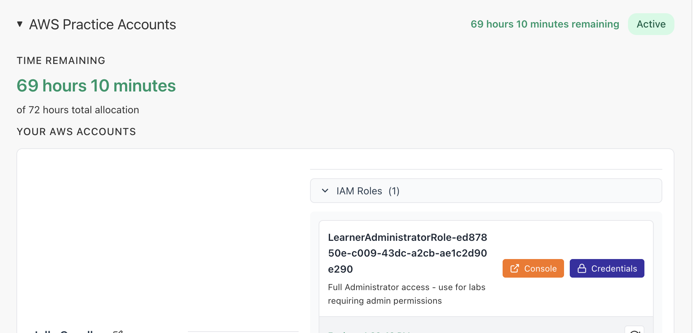
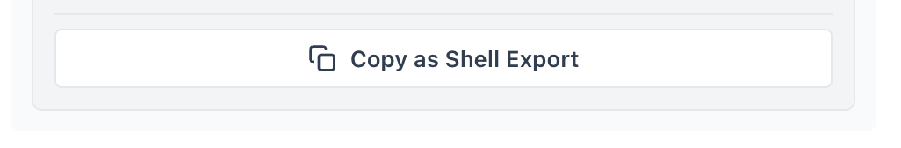
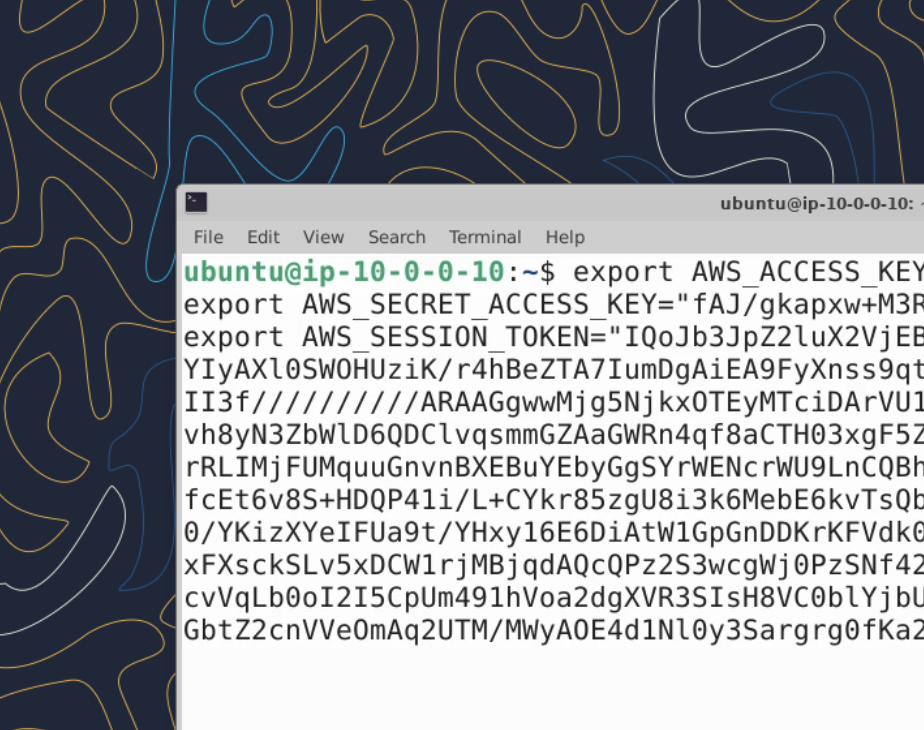

# Full-Day Workshop — Lab Setup

## Overview

Before the first attack scenario, you'll set up your workshop VM, deploy the vulnerable lab infrastructure, and build an IAM recon graph that every scenario in the workshop will query. By the end of this setup you will have:

- An authenticated VM in a sandbox AWS account
- Six intentionally-vulnerable IAM users plus a least-privilege `iamws-scanner-user` for read-only recon
- An [`iam-recon`](https://github.com/yourorg/iam-recon) graph of the account, ready to query offline
- A working mental model of the five privilege escalation categories used by [pathfinding.cloud](https://pathfinding.cloud)

The setup runs through Step 5. Steps 6–9 introduce iam-recon and tour the graph.

---

## Step 1: Access the VM

1. Find and copy your sandbox AWS credentials — you'll paste them into the workshop VM to authenticate it.

   

   Click **Credentials**, then click **Copy as Shell Export** to copy them to your clipboard.

   

   > **NOTE**
   > Copying and pasting in the Guacamole virtual desktop can be tricky. See [the Guacamole docs](https://guacamole.apache.org/doc/gug/using-guacamole.html) for OS-specific clipboard tips.

1. Paste the credentials into the VM terminal. Your VM is now authenticated against the sandbox AWS account.

   

   ```bash
   export AWS_ACCESS_KEY_ID=AKIA...
   export AWS_SECRET_ACCESS_KEY=...
   export AWS_SESSION_TOKEN=...
   ```

1. Verify:

   ```bash
   aws sts get-caller-identity
   ```

   Expected output:

   ```
   {
       "UserId": "<your user id>",
       "Account": "<your account id>",
       "Arn": "<your identity arn>"
   }
   ```

---

## Step 2: Clone the Workshop Repository

```bash
git clone https://github.com/TaraScho/ws-wrangling-identity-and-access-in-aws.git ~/workshop
cd ~/workshop
```

---

## Step 3: Run the Setup Script

```bash
bash labs-full-day/wwhf-setup.sh
```

The full-day setup script:

1. Verifies prerequisites (AWS credentials, `iam-recon`, Terraform)
1. Deploys the vulnerable lab infrastructure with Terraform
1. Configures AWS CLI profiles for **seven** users: the six intentionally-vulnerable exercise users (one per scenario) plus `iamws-scanner-user` — a least-privilege read-only identity used for IAM reconnaissance

When the script finishes you'll see:

```
=== Setup Complete! (6/6 checks passed) ===

You're ready to start the workshop. Happy hacking!
```

---

## Step 4: Reload Your Shell

The setup script added tools to your PATH, but your current terminal session needs to reload it:

```bash
source ~/.bashrc
```

---

## Step 5: Privilege Escalation Categories

Before you start identifying vulnerabilities, get familiar with how the security community organizes privilege escalation attacks. Throughout this workshop we'll reference [pathfinding.cloud](https://pathfinding.cloud), an open source knowledge base for understanding, detecting, and demonstrating AWS IAM privilege escalation.

1. Navigate to [pathfinding.cloud](https://pathfinding.cloud) in your browser.

1. Open the **Privilege Escalation Library**.

1. Note the **CATEGORY** drop-down filter. As of writing, pathfinding.cloud organizes paths into five categories:

   | Category              | Description                                                                                |
   |-----------------------|--------------------------------------------------------------------------------------------|
   | **Self-Escalation**   | Modify your own permissions directly to escalate privileges                                |
   | **Principal Access**  | Gain access to a different principal to escalate privileges                                |
   | **New PassRole**      | Create a new resource (EC2, Lambda, etc.) and pass a privileged role to it                 |
   | **Existing PassRole** | Modify an existing resource with an attached role and gain access to that role             |
   | **Credential Access** | Access hardcoded credentials stored insecurely                                             |

   You'll exploit vulnerabilities from each of these categories during the workshop. Click into a few paths now to see how each one is described — every iam-recon finding you'll see in Step 7 links back to one of these paths.

---

## Step 6: Meet `iam-recon`

`iam-recon` is a single-binary Rust tool that builds a directed graph of every IAM user, role, group, and policy in an AWS account, then maps the resulting privileges to the 66+ known attack paths catalogued by pathfinding.cloud. It is the only recon tool used in the full-day workshop — it consolidates the capabilities of the older Python tools you may have seen (PMapper, awspx) into one binary, plus first-class pathfinding.cloud integration.

What you can do with it:

- Build an offline graph of an AWS account in one command, then query it forever without re-hitting the AWS API.
- Identify principals that have known privilege escalation paths (`pathfinding`, `argquery --preset privesc`).
- Confirm individual permissions against simulated policy evaluation (`argquery --principal <name> --action <action>`).
- Explore the graph visually in a browser (`visualize --interactive-viz`) or in a terminal dashboard (`--tui`).

`iam-recon` is pre-installed on the workshop VM — no install step needed. Confirm it's there:

```bash
iam-recon --help | head -5
```

---

## Step 7: Build the IAM graph

Set the account ID once so you can reuse it for every iam-recon query in this and later steps:

```bash
ACCOUNT_ID=$(aws sts get-caller-identity --query Account --output text --profile iamws-scanner-user)
```

Build the graph:

```bash
iam-recon graph create --profile iamws-scanner-user
```

This takes about 30 seconds. Under the hood, iam-recon:

1. Calls `sts:GetCallerIdentity` and `iam:GetAccountAuthorizationDetails` (a single paginated API call that returns every user, role, group, and policy in the account)
1. Runs nine privilege escalation **edge checkers** — IAM, STS, Lambda, EC2, CodeBuild, CloudFormation, AutoScaling, SSM, SageMaker — and adds a graph edge whenever it finds a chain like "user X can launch an EC2 instance with role Y attached"
1. Caches every API response to `~/.local/share/iam-recon/<account-id>/`, so every subsequent iam-recon command can run fully offline by passing `--account $ACCOUNT_ID`

When it finishes you'll see something like:

```
Graph Data for Account:  <account ID>
# of Nodes:              ~36
# of Edges:              ~20  (privilege escalation edges)
# of Groups:             2
# of (tracked) Policies: ~50
# of Admins:             ~7
```

> **Why a dedicated scanner profile?**
> `iamws-scanner-user` is attached to the AWS-managed `SecurityAudit` policy — read-only access to IAM and every service iam-recon enumerates. Recon is a read-only activity; doing it with a least-privilege identity (instead of an admin profile) is the same principle you'll defend against attackers in Lab 2. Every other workshop scenario uses a scenario-specific exercise profile (e.g., `iamws-policy-developer-user`) for exploitation — never the scanner.

You can re-display this summary at any time without rescanning:

```bash
iam-recon --account $ACCOUNT_ID graph display
```

---

## Step 8: Tour the data

The three commands below are the iam-recon surfaces you'll use across the rest of the workshop. Run them now so you know what each one looks like.

### 8a. Map permissions to known attack paths (`pathfinding`)

```bash
iam-recon --account $ACCOUNT_ID pathfinding
```

This is the primary recon command — it walks every principal against the bundled pathfinding.cloud database and prints one entry per match. Each entry looks like:

```
[iam-001] user/iamws-policy-developer-user (self-escalation)
    Path: iam:CreatePolicyVersion
    Perms: iam:CreatePolicyVersion
    https://www.pathfinding.cloud/paths/iam-001
```

The bracketed ID (`iam-001`) is the pathfinding.cloud path identifier — every scenario in this workshop will point you at one or more of these IDs and ask you to find them in this output.

### 8b. Visualize the graph (`visualize --interactive-viz`)

```bash
iam-recon --account $ACCOUNT_ID visualize --interactive-viz
```

iam-recon prints a line like `Interactive visualization available at: http://127.0.0.1:54321` — **the port is dynamic**, so copy the URL it prints (the browser should also open automatically). The page renders a force-directed graph of every principal:

- **Red nodes** — admin-tier principals (full `*:*` access)
- **Orange nodes** — principals with at least one known privilege escalation path
- **Blue nodes** — regular users
- **Light cyan nodes** — regular roles

Click a node to inspect its policies and trust relationships. Click an edge to see the policy document that created it (e.g., the inline policy granting `iam:PassRole`). Use the **Privesc** filter to hide everything except the escalation paths.

Press `Ctrl+C` in the terminal when you're done — the visualization keeps running until you stop it.

### 8c. Check a specific permission (`argquery`)

```bash
iam-recon --account $ACCOUNT_ID argquery \
  --principal user/iamws-policy-developer-user \
  --action iam:CreatePolicyVersion
```

This evaluates a single principal against a single IAM action and prints `ALLOW` or `DENY` with the policy chain that produced the decision. You'll use this in every scenario to confirm a specific permission before exploiting it.

Expected output for the example above:

```
ALLOW user/iamws-policy-developer-user can call iam:CreatePolicyVersion with *
```

---

## Step 9: Optional — Terminal dashboard

If you prefer a CLI-first view, iam-recon ships a TUI that wraps all of the above:

```bash
iam-recon --tui --account $ACCOUNT_ID
```

Navigate with the arrow keys. Press `q` to quit. The TUI is purely a viewing tool — every action it surfaces is available as a regular CLI command, so feel free to skip it.

---

## What's next

You're ready for the warmup and the attack scenarios. See [`README.md`](README.md) for the day's running order; the warmup will pick up where this setup leaves off and get you oriented in the graph you just built.
